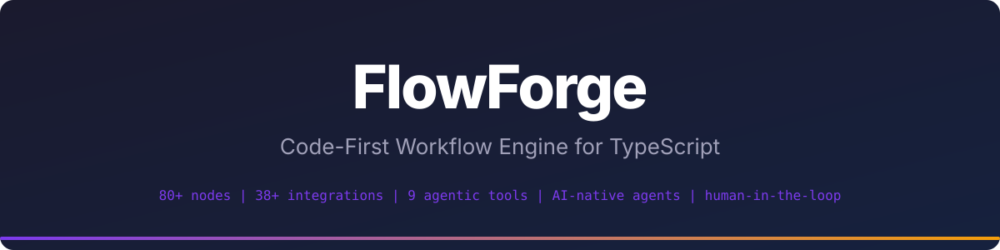

<p align="center">
  
</p>

<p align="center">
  <a href="https://www.npmjs.com/package/@flowforgejs/nodes"></a>
</p>

# @flowforgejs/nodes

80+ built-in nodes for FlowForge workflows, organized across 7 categories:

| Category      | Count | Examples                                                         |
| ------------- | ----- | ---------------------------------------------------------------- |
| Data          | 8     | HTTP, Postgres, Redis, MongoDB, Kafka, Elasticsearch, Pinecone   |
| AI            | 5     | Generate Text, Generate Object, Agent, Embed, MCP Client         |
| Communication | 44    | Slack, Email, Discord, GitHub, Notion, Telegram, Stripe, Webhook |
| Tools         | 9     | JSON, CSV, PDF, Screenshot, Search                               |
| Control       | 9     | If, Switch, ForEach, While, Parallel, Delay, SubWorkflow         |
| Transform     | 4     | Map, Filter, Reduce, Template                                    |
| Log           | 1     | Console logger                                                   |

## Install

```bash
npm install @flowforgejs/nodes
```

## Quick Example

```typescript
import { httpRequest } from '@flowforgejs/nodes/data/http';
import { generateText } from '@flowforgejs/nodes/ai/generate-text';
import { slackMessage } from '@flowforgejs/nodes/communication/slack';
import { workflow } from '@flowforgejs/sdk';

const pipeline = workflow('summarize-and-notify')
  .addNode(httpRequest)
  .addNode(generateText)
  .addNode(slackMessage)
  .connect('http-request', 'generate-text')
  .connect('generate-text', 'slack-message')
  .build();
```

---

<p align="center">Part of <a href="../../README.md">FlowForge</a></p>
